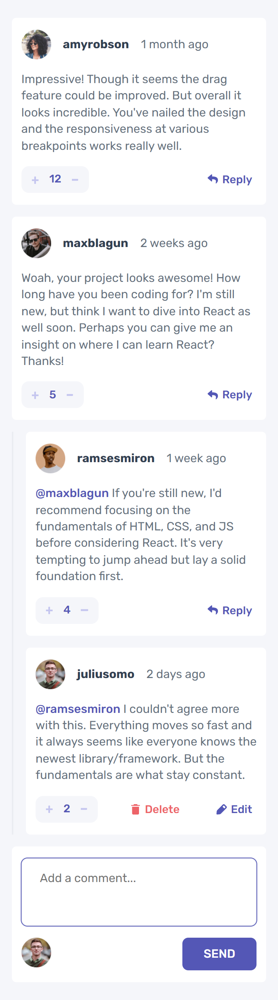
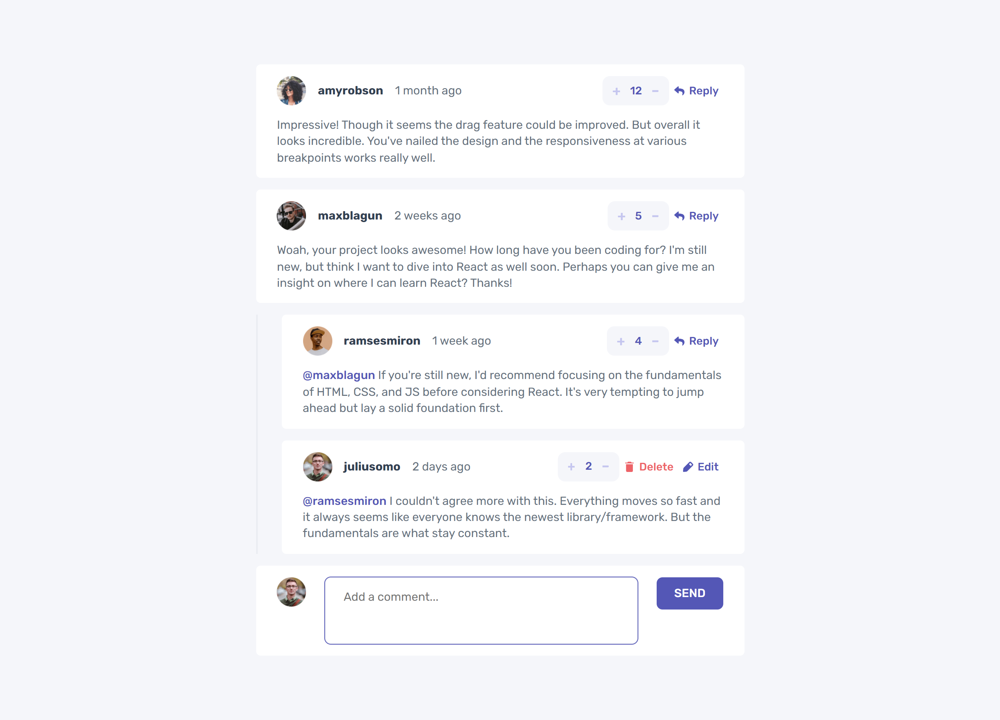

# COMMENT SECTION

Projeto para criação de uma seção de comentarios interativa

## Índice

- [Visão geral](#visao-geral)
  - [O Desafio](#o-desafio)
  - [Screenshot](#screenshot)
- [Resultado](#resultado)
- [Minha caminhada](#minha-caminhada)
  - [Propriedades](#propriedades)
  - [O que aprendi](#o-que-aprendi)
  - [Recursos](#recursos)
- [Autor](#autor)

## Visão Geral

### O Desafio

Os usuários devem ser capazes de:

- Visualizar o layout ideal para o aplicativo, dependendo do tamanho da tela do dispositivo
- Visualizar os estados de foco para todos os elementos interativos na página
- Responder, criar, editar, excluir e avaliar comentários

### Screenshots

<html>
  <h4>Layout mobile</h4>
  

  <h4>Layout desktop </h4>
  

</html>

## Resultado: [Veja como ficou!](???????????)

## Minha caminhada

1º dia

- [x] Planejamento
- [x] Preparativos

2º dia

- [x] Mobile layout

3º dia

- [x] Desktop layout

4º dia

- [x] Estados de foco

5º dia

- [x] Feature de responder comentários

6º dia

- [x] Feature de criar comentário

7º dia

- [ ] Refatoração

### Propriedades

- Mobile-first
- Semântica HTML
- SASS
- TypeScript

### Meu aprendizado

Modulação
Objetos

TypeScript

```ts
...

...
```

...

SASS

```scss
...

...
```

...

### Recursos

- [TYPESCRIPT - Documentation](https://www.typescriptlang.org/docs/) - Saiba mais sobre o superset.

- [SASS - Documentation](https://sass-lang.com/documentation/) - Nesse site você saberá tudo sobre o mundo SASS.

- [O desafio da Frontend Mentor](https://www.frontendmentor.io/challenges/interactive-comments-section-iG1RugEG9) - Neste link você encontrará o desafio solucionado aqui.

## Autor

- LinkedIn - [Pedro A. Lima](https://www.linkedin.com/in/pedroalima6/)
